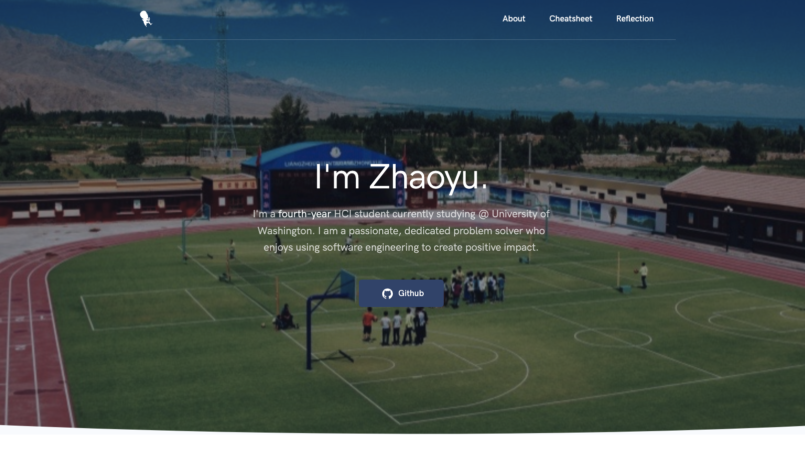

# Portfolio Website

url: https://andrewliu66.github.io/HCDE438_portfolio/reflection.html

## Description

This repository contains all the source code of my personal website. I constantly update my website as there are new contents coming up.



## Development

I used `webpack` to automate the build process and `npm` to download all the necessary javascript library dependencies. The process to run this repository is very straightforward

1. download all necessary npm packages

```
$ npm install
```

2. run the project

```
$ npm run start
```

To build the production files, run the following:

```
$ npm run build
```

The production files will be in the `dist/` folder.

## Deploy

```
git subtree push --prefix dist origin build
```
